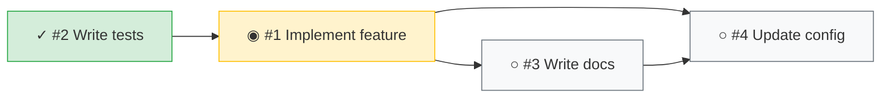

# Dependency Graph Operation

Renders task dependency relationships as an ASCII diagram or mermaid flowchart.

## Purpose

Visualizes blocking relationships between tasks in the current workspace, showing dependency ordering at a glance instead of flat `[blocked by #X]` annotations.

## Inputs

- **format** (optional): Output format
  - `ascii` (default): Terminal-friendly ASCII diagram
  - `mermaid`: Mermaid flowchart syntax for rich rendering
- **task-list-id** (optional): Override task list ID (defaults to `CLAUDE_CODE_TASK_LIST_ID` from workspace `.envrc`)

## Implementation Steps

### 1. Parse User Request

Extract format preference from user input.

**Valid formats**:
- `/task-deps`
- `/task-deps mermaid`
- `Show task dependency graph`
- `Show me the dependency diagram`

**Default**: `ascii` if no format specified

### 2. Resolve Task List ID

Determine which task list to visualize:

1. Use explicit `--task-list-id` if provided
2. Otherwise use `CLAUDE_CODE_TASK_LIST_ID` environment variable from workspace `.envrc`
3. Error if neither is available

### 3. Run Renderer

**ASCII output**:
```bash
${CLAUDE_PLUGIN_ROOT}/skills/task-workflow/scripts/render_deps.py --task-list-id "$CLAUDE_CODE_TASK_LIST_ID"
```

**Mermaid output**:
```bash
${CLAUDE_PLUGIN_ROOT}/skills/task-workflow/scripts/render_deps.py --task-list-id "$CLAUDE_CODE_TASK_LIST_ID" --mermaid
```

### 4. Handle Edge Cases

| Case | Response |
|------|----------|
| No tasks found | "No tasks found." |
| No dependencies | Shows all tasks as standalone nodes |
| Circular dependency | Error: "Cycle detected in task dependencies" |
| Missing task list ID | "Error: --task-list-id required or set CLAUDE_CODE_TASK_LIST_ID" |

## Output Examples

### ASCII (default)

```
  #2 ✓ Write tests ──► #1

  #1 ◉ Implement feature ──► #3, #4

  #3 ○ Write docs ──► #4

  #4 ○ Update config
```

**Status icons**:
- `✓` completed
- `◉` in progress
- `○` pending

**Layout**: Tasks grouped by dependency layer (topological order), arrows show what each task blocks.

### Mermaid



## Scripts Reference

| Script | Purpose | Arguments |
|--------|---------|-----------|
| `render_deps.py` | Render dependency graph | `--task-list-id ID`, `--mermaid` |

## Implementation Checklist

When implementing this operation:

1. Determine output format from user request (default: ascii)
2. Resolve task list ID from args or environment
3. Run `render_deps.py` with appropriate flags
4. Present output to user
